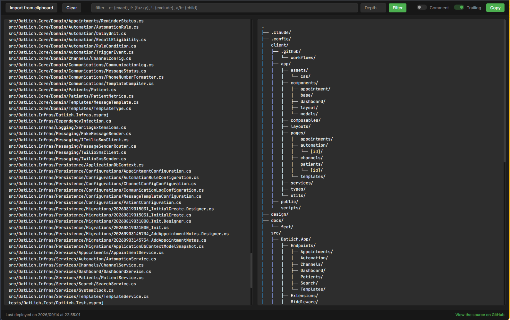

# git ls-tree

Web app: paste flat file-path list -> tree view. Search, filter, depth-limit, copy output.

## Screenshot



## Features

- Flat path list -> tree structure, instant render
- Import from clipboard button (pair with `git ls-tree` output)
- Search box with mini query syntax:
  - `word` — substring match on path segment
  - `e:{word}` — exact segment match
  - `f:{word}` — fuzzy match (VSCode-style, chars in order)
  - `!word` — exclude paths matching word
  - `a/b` — match consecutive parent/child segments
- Depth input — cap tree render depth
- Filter panel — checkbox tree to include/exclude specific folders (persisted in localStorage), with Select all / Clear all
- Comment toggle — append aligned comments to output lines
- Trailing toggle — append trailing `/` to folder names
- Copy button — copy rendered tree to clipboard

## Usage

```bash
git ls-tree -r --name-only HEAD | clip
```

Paste into the left textarea, or click **Import from clipboard**. Tree renders on the right. Adjust search/depth/filters as needed, then **Copy**.

## Example

Input:
```
src/components/Header.js
src/components/Footer.js
src/pages/Home.js
src/pages/About.js
src/styles/main.css
```

Output:
```
src
├── components/
├── pages/
└── styles/
```

## Technologies

- HTML
- CSS
- JavaScript (Vanilla)

## License

MIT License

Copyright (c) 2024

Permission is hereby granted, free of charge, to any person obtaining a copy
of this software and associated documentation files (the "Software"), to deal
in the Software without restriction, including without limitation the rights
to use, copy, modify, merge, publish, distribute, sublicense, and/or sell
copies of the Software, and to permit persons to whom the Software is
furnished to do so, subject to the following conditions:

The above copyright notice and this permission notice shall be included in all
copies or substantial portions of the Software.

THE SOFTWARE IS PROVIDED "AS IS", WITHOUT WARRANTY OF ANY KIND, EXPRESS OR
IMPLIED, INCLUDING BUT NOT LIMITED TO THE WARRANTIES OF MERCHANTABILITY,
FITNESS FOR A PARTICULAR PURPOSE AND NONINFRINGEMENT. IN NO EVENT SHALL THE
AUTHORS OR COPYRIGHT HOLDERS BE LIABLE FOR ANY CLAIM, DAMAGES OR OTHER
LIABILITY, WHETHER IN AN ACTION OF CONTRACT, TORT OR OTHERWISE, ARISING FROM,
OUT OF OR IN CONNECTION WITH THE SOFTWARE OR THE USE OR OTHER DEALINGS IN THE
SOFTWARE.
